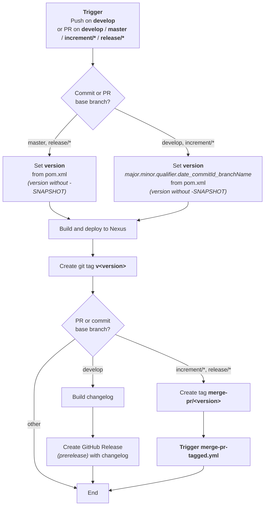
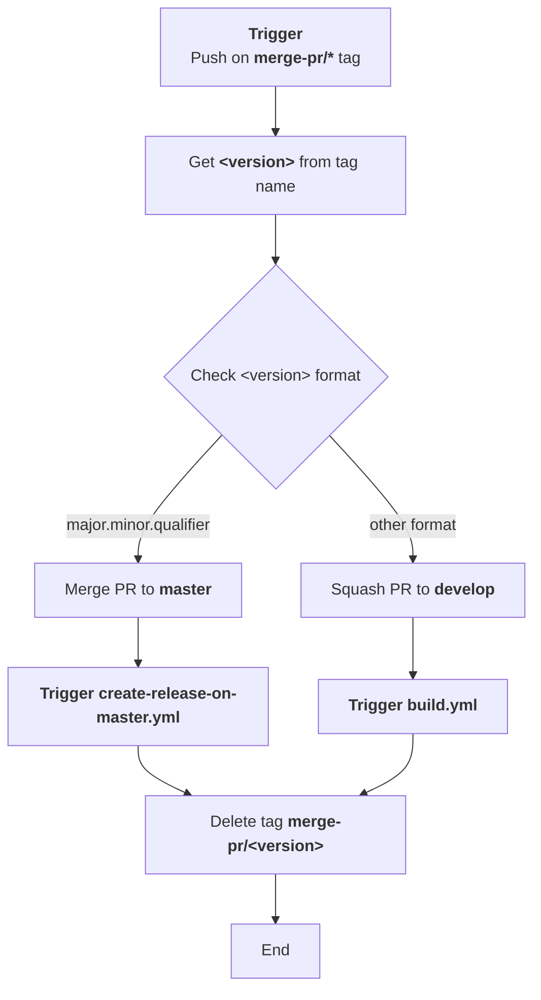
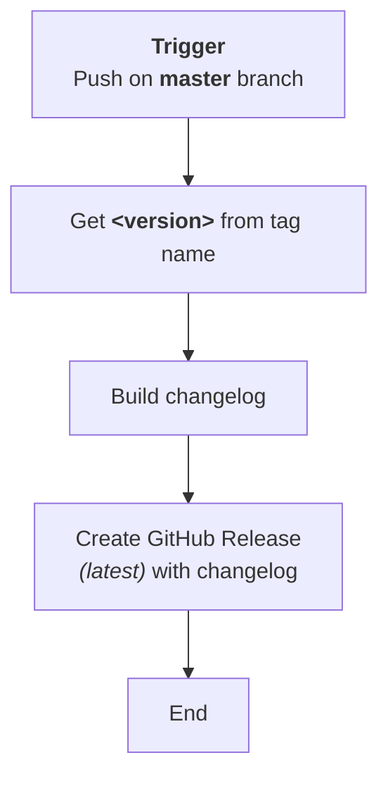
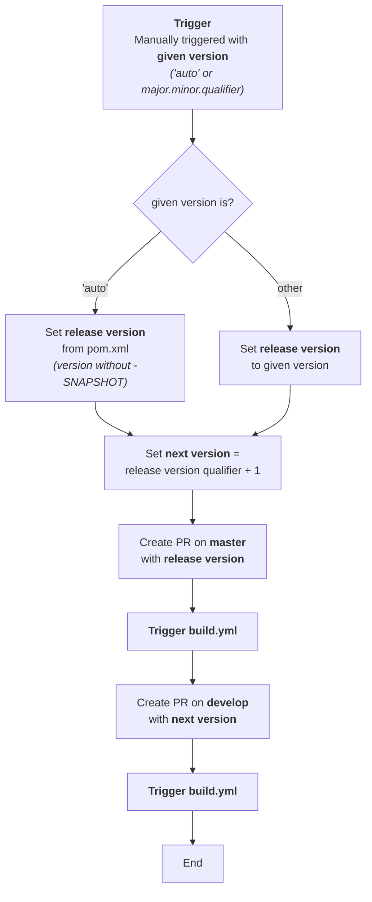

# Development Version and Branch Handling

A comprehensive CI/CD guide for JUDO NG modules, covering branch strategy, version numbering, GitHub Actions workflows, and development rules.

---

## Table of Contents

- [Branches](#branches)
- [Version Numbers](#version-numbers)
- [GitHub Action Workflows](#github-action-workflows)
  - [build.yml](#buildyml)
  - [merge-pr-tagged.yml](#merge-pr-taggedyml)
  - [create-release-on-master.yml](#create-release-on-masteryml)
  - [release.yml](#releaseyml)
- [How to Develop](#how-to-develop)

---

## Branches

The versioning policy of JUDO NG modules is based on [GitFlow](https://www.atlassian.com/git/tutorials/comparing-workflows/gitflow-workflow).

| Branch | Purpose |
|--------|---------|
| **develop** | Development branch containing the latest development sources of the last active version |
| **feature/JNG-NUMBER_short_summary** | Feature branches based on **develop**; contain sources of new features that will be included in the last active version |
| **(release/)X_Y_qualifierN** | Release branches (e.g. `1_0_beta1`). The `release/` prefix is reserved for CI |
| **bugfix/JNG-NUMBER_short_summary** | Bugfix branches based on release branches; must be applied to release and development branches of newer versions too |
| **support/JNG-NUMBER_short_summary** | Support branches based on release branches; must be applied to release and development branches of newer versions too |
| **master** | Contains the latest released sources of the last active version |

### Branch Relationships

```mermaid
%%{init: {'theme': 'base', 'themeVariables': {'git0': '#90EE90', 'git1': '#6495ED', 'git2': '#FFD700', 'git3': '#00FFFF', 'git4': '#FF6347', 'git5': '#7FFFD4'}}}%%
gitgraph
    commit id: "init"
    branch develop order: 1
    checkout develop
    commit id: "dev-1"

    branch "feature/JNG-2" order: 2
    commit id: "feat-2a"
    commit id: "feat-2b"
    checkout develop
    merge "feature/JNG-2" id: "merge-feat-2"

    branch "feature/JNG-1" order: 3
    commit id: "feat-1a"
    commit id: "feat-1b"
    checkout develop
    merge "feature/JNG-1" id: "merge-feat-1"

    branch "feature/JNG-3" order: 4
    commit id: "feat-3a"
    checkout develop
    merge "feature/JNG-3" id: "merge-feat-3"

    branch "release/1.0-beta1" order: 5
    commit id: "rel-1.0b1-a"

    branch "bugfix/JNG-4" order: 6
    commit id: "bugfix-4a"
    checkout "release/1.0-beta1"
    merge "bugfix/JNG-4" id: "merge-bugfix-4"

    checkout develop
    commit id: "dev-bump"

    checkout "release/1.0-beta1"
    checkout develop
    merge "release/1.0-beta1" id: "merge-rel-1.0b1"

    branch "release/1.0-beta2" order: 7
    commit id: "rel-1.0b2-a"

    branch "support/JNG-5" order: 8
    commit id: "support-5a"
    checkout "release/1.0-beta2"
    merge "support/JNG-5" id: "merge-support-5"
    commit id: "rel-1.0b2-b"

    checkout master
    merge "release/1.0-beta2" id: "release-1.0b2"

    branch "hotfix/JNG-6" order: 9
    commit id: "hotfix-6a"
    checkout master
    merge "hotfix/JNG-6" id: "merge-hotfix-6"

    checkout develop
    merge "hotfix/JNG-6" id: "hotfix-to-dev"

    branch "release/1.1-beta1" order: 10
    commit id: "rel-1.1b1-a"
    commit id: "rel-1.1b1-b"
    checkout master
    merge "release/1.1-beta1" id: "release-1.1b1"

    checkout develop
    merge "release/1.1-beta1" id: "merge-rel-1.1b1"
```

---

## Version Numbers

Version numbers follow semantic versioning. The rules depend on the branch type:

| Branch Type | Version Rule |
|-------------|-------------|
| **feature/** | Do **not** change version numbers when starting a feature branch |
| **develop** | The 2nd number is increased when a release branch is started |
| **bugfix/** | Do **not** change version numbers; bugfixes are applied on release branches during testing before merging to master |
| **support/** | The 3rd number is increased when the branch is started; used to support a previous release with minor changes. Merged back to the release branch when the update is released (without merging to master) |
| **hotfix/** | The 4th number is increased when the branch is started; applied to both release and master branches |

---

## GitHub Action Workflows

Four GitHub Actions workflows automate the build, merge, release, and changelog process.

### build.yml

Triggered by pushes and pull requests. Builds the project, deploys artifacts, creates tags, and optionally triggers downstream workflows.



### merge-pr-tagged.yml

Triggered when a `merge-pr/*` tag is pushed. Routes the merge to either **master** (for release versions) or **develop** (for development versions).



### create-release-on-master.yml

Triggered by a push to **master**. Builds the changelog and creates a GitHub Release marked as the latest release.



### release.yml

Manually triggered to start a release process. Creates two pull requests: one targeting **master** with the release version, and one targeting **develop** with the next development version.



---

## How to Develop

For issue tracking, the project uses [JIRA](https://blackbelt.atlassian.net/jira/dashboards).

> **Important:** There is no commit without a ticket number. Every pull request or commit **must** include a JIRA ticket reference in the format `JNG-xxx`.
