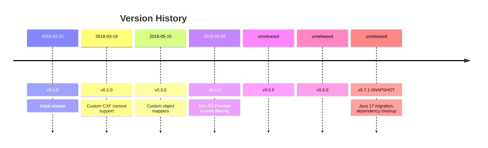

# Changelog

All notable changes to the CXF JAX-RS Application Manager are documented in this file. This includes new features, bug fixes, dependency updates, and breaking changes.

## v0.7.1-SNAPSHOT [unreleased]

- JNG-6324: Remove guava and jodatime
- JNG-6310: Update epsilon
- JNG-5995: Update eclipse and epsilon
- JNG-5821: Fixing login loop
- JNG-5674: Improve error handling
- JNG-4839: Java 11 to 17 migration

## v0.6.0 [unreleased]

## v0.5.0 [unreleased]

## v0.4.0 [2018-09-06]

- Filter bundles by JAX-RS Provider service tracker (using bundle header)

## v0.3.0 [2018-05-15]

### Features

- Support custom object mappers

## v0.2.0 [2018-03-19]

### Features

- Support custom CXF context (busses, interceptors) instead of global configuration

## v0.1.0 [2018-02-22]

- Initial release
