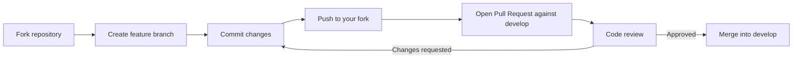

# Contributing to CXF JAX-RS Application Manager

Thank you for your interest in contributing to this project. The CXF JAX-RS Application Manager is an OSGi bundle that provides lifecycle management for JAX-RS applications running on Apache CXF. It handles server creation, shared JAX-RS provider registration, request/response interceptors, and application routing within an OSGi container.

This document covers everything you need to get started as a contributor.

---

## Prerequisites

### Java and Maven

This project requires **Java 17** and uses the [Maven Wrapper](https://maven.apache.org/wrapper/) (`mvnw`) so you do not need a global Maven installation. Make sure your environment satisfies the full set of requirements described in the parent project's [CONTRIBUTING guide](https://github.com/BlackBeltTechnology/judo-community/blob/develop/CONTRIBUTING.adoc).

| Requirement | Version |
|---|---|
| Java (JDK) | 17 |
| Maven | Provided by `./mvnw` |
| Git | 2.x+ |

> **Note**
> Always use `./mvnw` (or `mvnw.cmd` on Windows) instead of a system-installed `mvn` to ensure build reproducibility.

---

## Code Structure

This is a single-module Maven project. All production source code lives under `src/main/java` in the `hu.blackbelt.jaxrs` package hierarchy. There are no submodules.

### Packages

| Package | Purpose |
|---|---|
| `hu.blackbelt.jaxrs` | Core classes for server and application lifecycle management (`CxfServerManager`, `ApplicationManager`, `ApplicationStore`, `SharedProviderStore`, `ServerManager`, `CxfContext`). |
| `hu.blackbelt.jaxrs.application` | JAX-RS `Application` implementations such as `BasicApplication`. |
| `hu.blackbelt.jaxrs.providers` | JAX-RS providers for JSON serialization and parameter handling (`JacksonProvider`, `ExtendedObjectMapperProvider`, `ISO8601DateParamHandler`). |
| `hu.blackbelt.jaxrs.interceptors` | CXF interceptors for cross-cutting concerns like request tracing (`ExchangeIdDecorator`, `ExchangeIdResponseWriter`). |

### Key files

- **`pom.xml`** -- Build descriptor; declares OSGi metadata, dependency versions, and plugin configuration.
- **`src/main/java/`** -- All production Java sources (see packages above).

---

## Contribution Workflow

The project follows a standard GitHub fork-and-pull model. The `develop` branch is the integration branch; feature work happens on short-lived topic branches named after JIRA tickets (e.g., `feature/JNG-1234`).



### Step by step

1. **Fork** the repository on GitHub.
2. **Clone** your fork locally and create a branch from `develop`:
   ```bash
   git checkout develop
   git pull origin develop
   git checkout -b feature/JNG-XXXX
   ```
3. **Make your changes**, commit with a message that references the JIRA ticket:
   ```
   JNG-XXXX Short description of the change
   ```
4. **Push** the branch to your fork and open a **Pull Request** targeting `develop`.
5. Address any review feedback by pushing additional commits to the same branch.
6. Once approved, a maintainer will merge the PR.

---

## Submission Guidelines

### Submitting an Issue

Before you submit an issue, please search the [issue tracker](https://github.com/BlackBeltTechnology/cxf-jaxrs-application-manager/issues) -- your problem may already have been reported or resolved.

We want to fix all issues as soon as possible, but before fixing a bug we need to reproduce and confirm it. A reproducible scenario saves everyone time. When filing an issue, please include:

- Output of `java -version` and `./mvnw -version`
- Your `pom.xml` or `.flattened-pom.xml` (when applicable)
- A minimal use-case that demonstrates the failure

> **Important**
> We will insist on a minimal reproduction. Isolating the problem is a prerequisite for a fix and allows us to address more issues overall.

You can file a new issue using the [issue form](https://github.com/BlackBeltTechnology/cxf-jaxrs-application-manager/issues/new/choose).

### Submitting a Pull Request

Follow the workflow described above. Make sure all tests pass locally before opening a PR:

```bash
./mvnw clean verify
```

Keep PRs focused on a single change. If your contribution involves multiple independent improvements, split them into separate PRs.

---

## Commands

All commands should be run from the project root using the Maven Wrapper.

### Run Tests

```bash
./mvnw clean test
```

### Run Full Build

```bash
./mvnw clean install
```

### Run Full Build (skipping tests)

```bash
./mvnw clean install -DskipTests
```
