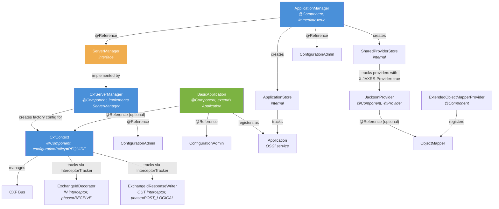
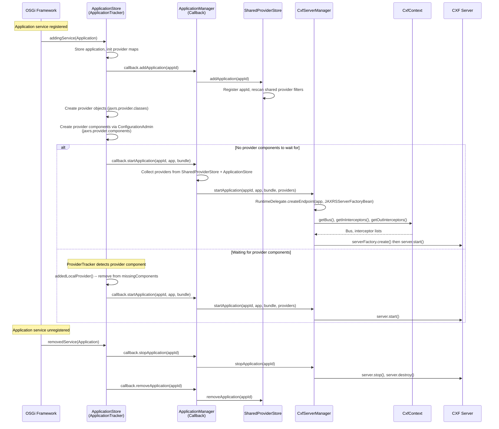
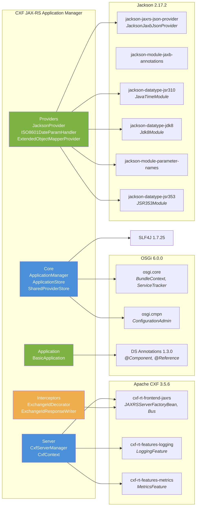

# CXF JAX-RS Application Manager

A framework for dynamically managing JAX-RS applications, resources, and providers in an OSGi environment. It automatically exposes `javax.ws.rs.core.Application` OSGi service components as RESTful web services using Apache CXF, handling the full lifecycle of application registration, provider tracking, and CXF server management.

**Coordinates:** `hu.blackbelt.cxf:cxf-jaxrs-application-manager`
**Java:** 17 | **Packaging:** OSGi bundle | **License:** Apache 2.0

---

## Table of Contents

- [Architecture Overview](#architecture-overview)
- [Component Overview Diagram](#component-overview-diagram)
- [Application Lifecycle](#application-lifecycle)
- [Class Diagram](#class-diagram)
- [Dependency Graph](#dependency-graph)
- [How It Works](#how-it-works)
- [Configuration Reference](#configuration-reference)
- [Quick Start](#quick-start)
- [Preparing the Runtime Environment](#preparing-the-runtime-environment)

---

## Architecture Overview

The project is a single Maven module that produces an OSGi bundle. At its core, the **ApplicationManager** component acts as the central coordinator. On activation, it creates two internal stores:

- **ApplicationStore** -- tracks `javax.ws.rs.core.Application` OSGi services via a `ServiceTracker`. When an application appears, disappears, or changes, the store manages its provider components and objects and notifies the manager through a callback interface.
- **SharedProviderStore** -- tracks JAX-RS providers that are shared across applications. Providers from bundles with the `X-JAXRS-Provider: true` manifest header are picked up automatically. Providers without an `applications.filter` property become **global** (applied to all applications); those with a filter become **shared** (applied only to matching applications).

The **ServerManager** interface abstracts the actual server lifecycle. Its sole implementation, **CxfServerManager**, creates `JAXRSServerFactoryBean` instances and manages CXF `Server` objects. It delegates CXF bus management to **CxfContext** components.

---

## Component Overview Diagram



---

## Application Lifecycle

This sequence diagram shows what happens when a `BasicApplication` is registered as an OSGi service and eventually started as a CXF server.



---

## Class Diagram

```mermaid
classDiagram
    class ApplicationManager {
        -ServerManager serverManager
        -ConfigurationAdmin configAdmin
        -ApplicationStore applicationStore
        -SharedProviderStore sharedProviderStore
        +start(BundleContext) void
        +stop() void
        -getSingleApplicationProviders(Long) List~Object~
        -getApplicationProviders(Collection~Long~) Map
    }

    class ApplicationStore {
        -ConfigurationAdmin configAdmin
        -ApplicationTracker applicationTracker
        -ProviderTracker providerTracker
        -Map~Long, Application~ applications
        -Map~Long, Map~ providerComponents
        -Map~Long, Map~ providerObjects
        +start() void
        +stop() void
        +getProviders(Long) List~Object~
        +getApplicationIds() Set~Long~
    }

    class SharedProviderStore {
        -SharedProviderTracker sharedProviderTracker
        -Map~Long, Set~ sharedApplicationProviders
        -Map~Long, Object~ globalProviders
        -Map~Long, Object~ sharedProviders
        +start() void
        +stop() void
        +addApplication(Long) void
        +removeApplication(Long) void
        +getProviders(Long) List~Object~
    }

    class ServerManager {
        <<interface>>
        +startApplication(Long, Application, Bundle, List) void
        +stopApplication(Long) Application
        +updateApplicationResources(Long, Application, List) void
        +restartApplications(Collection, Map) void
        +restartAllApplications(Map) void
        +shutdown() void
    }

    class CxfServerManager {
        -Map~Long, Server~ servers
        -Map~Long, Application~ applications
        -ConfigurationAdmin configAdmin
        -Configuration cxfContextConfig
        +start(Config) void
        +stop() void
    }

    class CxfContext {
        -Bus bus
        -ConfigurationAdmin configAdmin
        -List inInterceptors
        -List outInterceptors
        -List faultInterceptors
        +getBus() Bus
        +getInInterceptors() List
        +getOutInterceptors() List
        +getFaultInterceptors() List
    }

    class BasicApplication {
        -Set~Class~ classes
        -Set~Object~ components
        -ResourceTracker tracker
        -CxfContext cxfContext
        -ConfigurationAdmin configAdmin
        +getClasses() Set~Class~
        +getSingletons() Set~Object~
        +getProperties() Map
    }

    class JacksonProvider {
        -ObjectMapper objectMapper
        -JacksonJaxbJsonProvider jacksonJaxbJsonProvider
        +configure(BundleContext, Map) void
    }

    class ExtendedObjectMapperProvider {
        +activate(BundleContext) void
        +getExtendedObjectMapper()$ ObjectMapper
    }

    class ExchangeIdDecorator {
        +handleMessage(Message) void
        +createExchangeId(Message) String
    }

    class ExchangeIdResponseWriter {
        +handleMessage(Message) void
        +handleFault(Message) void
    }

    class ISO8601DateParamHandler {
        -DateFormat dateFormat
        +getConverter(Class, Type, Annotation[]) ParamConverter
    }

    ApplicationManager --> ServerManager : @Reference
    ApplicationManager *-- ApplicationStore : creates
    ApplicationManager *-- SharedProviderStore : creates
    ServerManager <|.. CxfServerManager : implements
    CxfServerManager --> CxfContext : creates via ConfigurationAdmin
    BasicApplication --> CxfContext : @Reference (optional)
    BasicApplication --|> Application : extends
    JacksonProvider --> ObjectMapper : @Reference (optional)
    ExtendedObjectMapperProvider ..> ObjectMapper : registers as OSGi service
    ExchangeIdDecorator --|> AbstractPhaseInterceptor : extends
    ExchangeIdResponseWriter --|> AbstractPhaseInterceptor : extends
    ISO8601DateParamHandler ..|> ParamConverterProvider : implements

    class ApplicationStore_Callback {
        <<interface>>
        +addApplication(Long)
        +removeApplication(Long)
        +startApplication(Long, Application, Bundle)
        +stopApplication(Long)
        +restartApplications(Collection)
        +updateApplicationResources(Long, Application)
    }

    class SharedProviderStore_Callback {
        <<interface>>
        +restartApplications(Collection)
    }

    ApplicationStore --> ApplicationStore_Callback : uses
    SharedProviderStore --> SharedProviderStore_Callback : uses
    ApplicationManager ..|> ApplicationStore_Callback : inner class implements
    ApplicationManager ..|> SharedProviderStore_Callback : inner class implements
```



---

## Dependency Graph



---

## How It Works

### Application Discovery

When the `ApplicationManager` component activates, it opens two OSGi `ServiceTracker` instances:

1. **ApplicationTracker** (inside `ApplicationStore`) listens for any service registered under `javax.ws.rs.core.Application`. When one appears, it:
   - Records the application and its `applicationPath` service property.
   - Instantiates provider objects listed in the `jaxrs.provider.classes` property.
   - Creates provider component configurations via `ConfigurationAdmin` for classes listed in `jaxrs.provider.components`.
   - Starts the CXF server once all required provider components are available.

2. **SharedProviderTracker** (inside `SharedProviderStore`) listens for any service whose bundle has the manifest header `X-JAXRS-Provider: true` and whose class carries the `@Provider` annotation. These providers are categorized as:
   - **Global** -- no `applications.filter` property; applied to every application.
   - **Shared** -- has an `applications.filter` LDAP filter; applied only to applications matching that filter.

### Application Path Resolution

The path for a JAX-RS application is determined in order of precedence:

1. The `applicationPath` OSGi service property (set via Configuration Admin or in the `BasicApplication` config).
2. The `@javax.ws.rs.ApplicationPath` annotation on the application class.

### CXF Bus Management

`CxfServerManager` automatically creates a default `CxfContext` factory configuration on activation. The `CxfContext` component creates a CXF `Bus`, registers it as an OSGi service, and opens `InterceptorTracker` instances for IN, OUT, and FAULT interceptors based on LDAP filter expressions.

When starting an application, `CxfServerManager` obtains the `Bus` and interceptor lists from the `CxfContext` associated with the application (either through `BasicApplication.cxf.context` or the default bus) and configures the `JAXRSServerFactoryBean` accordingly.

### Provider Lifecycle

Providers follow three distinct paths:

| Provider Type | How Configured | Scope |
|---|---|---|
| **Provider objects** | `jaxrs.provider.classes` property on the Application service | Single application |
| **Provider components** | `jaxrs.provider.components` property; managed via ConfigurationAdmin | Single application |
| **Global providers** | Bundle header `X-JAXRS-Provider: true`, no `applications.filter` | All applications |
| **Shared providers** | Bundle header `X-JAXRS-Provider: true`, with `applications.filter` | Matching applications |

---

## Configuration Reference

### BasicApplication

**PID:** `hu.blackbelt.jaxrs.application.BasicApplication`

A Declarative Service component that extends `javax.ws.rs.core.Application`. It allows defining JAX-RS applications entirely through Configuration Admin, without writing a custom `Application` subclass.

| Property | Type | Required | Description |
|---|---|---|---|
| `applicationPath` | `String` | Yes | The URL path prefix for this application (e.g., `/api/rest`) |
| `jaxrs.application.name` | `String` | No | Human-readable name for the application |
| `jaxrs.resource.classes` | `String` | No | Comma-separated list of fully qualified JAX-RS resource class names |
| `jaxrs.resource.components` | `String` | No | OSGi LDAP filter to track resource components dynamically |
| `jaxrs.provider.classes` | `String` | No | Comma-separated list of JAX-RS provider class names to instantiate |
| `jaxrs.provider.components` | `String` | No | Comma-separated list of JAX-RS provider component factory PIDs |
| `cxf.context.target` | `String` | No | OSGi target filter for selecting a specific `CxfContext` (e.g., `(busId=myBus)`) |

**Example** (`hu.blackbelt.jaxrs.application.BasicApplication-poc.cfg`):

```properties
applicationPath=/poc/rest
jaxrs.application.name=poc
jaxrs.resource.components=(appName=poc)
#cxf.context.target=(busId=pocBus)
```

### CxfContext

**PID:** `hu.blackbelt.jaxrs.CxfContext` (factory configuration, `configurationPolicy=REQUIRE`)

Each instance manages a dedicated CXF `Bus`. Use this when you need multiple isolated CXF buses (for example, different interceptor chains for different application groups).

| Property | Type | Required | Default | Description |
|---|---|---|---|---|
| `busId` | `String` | Yes | -- | Unique identifier for the CXF bus |
| `skipDefaultJsonProviderRegistration` | `boolean` | No | `true` | Skip the built-in CXF JSON provider |
| `wadlServiceDescriptionAvailable` | `boolean` | No | `true` | Enable WADL service description |
| `interceptors.in.components` | `String` | No | -- | LDAP filter for IN interceptor services |
| `interceptors.out.components` | `String` | No | -- | LDAP filter for OUT interceptor services |
| `interceptors.fault.components` | `String` | No | -- | LDAP filter for FAULT interceptor services |
| `metrics.enabled` | `boolean` | No | `false` | Enable CXF `MetricsFeature` on the bus |
| `logging.enabled` | `boolean` | No | `false` | Enable CXF `LoggingFeature` on the bus |

**Example** (`hu.blackbelt.jaxrs.CxfContext-pocBus.cfg`):

```properties
busId=pocBus
skipDefaultJsonProviderRegistration=true
wadlServiceDescriptionAvailable=true
interceptors.in.components=(&(objectClass=org.apache.cxf.interceptor.Interceptor)(direction=in))
interceptors.out.components=(&(objectClass=org.apache.cxf.interceptor.Interceptor)(direction=out))
```

### CxfServerManager

**PID:** `hu.blackbelt.jaxrs.CxfServerManager`

A singleton component that implements `ServerManager`. It automatically creates a default `CxfContext` on activation. Configuration properties here are forwarded to the auto-created default bus.

| Property | Type | Required | Default | Description |
|---|---|---|---|---|
| `skipDefaultJsonProviderRegistration` | `boolean` | No | `false` | Skip CXF default JSON provider |
| `wadlServiceDescriptionAvailable` | `boolean` | No | `false` | Enable WADL |
| `interceptors.in.components` | `String` | No | -- | LDAP filter for IN interceptors |
| `interceptors.out.components` | `String` | No | -- | LDAP filter for OUT interceptors |
| `interceptors.fault.components` | `String` | No | -- | LDAP filter for FAULT interceptors |

**Example** (`hu.blackbelt.jaxrs.CxfServerManager.cfg`):

```properties
skipDefaultJsonProviderRegistration=true
wadlServiceDescriptionAvailable=true
interceptors.in.components=(&(objectClass=org.apache.cxf.interceptor.Interceptor)(direction=in))
interceptors.out.components=(&(objectClass=org.apache.cxf.interceptor.Interceptor)(direction=out))
interceptors.fault.components=(&(objectClass=org.apache.cxf.interceptor.Interceptor)(direction=out))
```

### JacksonProvider

**PID:** `hu.blackbelt.jaxrs.providers.JacksonProvider` (`configurationPolicy=REQUIRE`)

Configures a `JacksonJaxbJsonProvider` and registers it as an OSGi service. Supports an optional `@Reference` to a custom `ObjectMapper`.

| Property | Type | Description |
|---|---|---|
| `JacksonProvider.SerializationFeature.<FEATURE>` | `boolean` | Set a Jackson `SerializationFeature` (e.g., `INDENT_OUTPUT`) |
| `JacksonProvider.DeserializationFeature.<FEATURE>` | `boolean` | Set a Jackson `DeserializationFeature` (e.g., `FAIL_ON_UNKNOWN_PROPERTIES`) |
| `JacksonProvider.ObjectMapper.modules` | `String` | Comma-separated list of Jackson `Module` FQCNs to register (ignored when a custom ObjectMapper is injected) |
| `applications.filter` | `String` | Optional LDAP filter to limit which applications receive this provider |

**Example** (`hu.blackbelt.jaxrs.providers.JacksonProvider.cfg`):

```properties
JacksonProvider.SerializationFeature.INDENT_OUTPUT=true
```

### ExtendedObjectMapperProvider

**PID:** `hu.blackbelt.jaxrs.providers.ExtendedObjectMapperProvider` (`configurationPolicy=REQUIRE`)

Creates and registers an `ObjectMapper` as an OSGi service with the following modules pre-registered: `ParameterNamesModule`, `Jdk8Module`, `JavaTimeModule`, `JSR353Module`. Serialization inclusion is set to `NON_NULL`.

> **Note:** The configuration file can be a simple placeholder. The component just needs to be activated.

**Example** (`hu.blackbelt.jaxrs.providers.ExtendedObjectMapperProvider.cfg`):

```properties
placeholder=true
```

### ISO8601DateParamHandler

**PID:** `hu.blackbelt.jaxrs.providers.ISO8601DateParamHandler` (`configurationPolicy=REQUIRE`)

A `ParamConverterProvider` that parses `java.util.Date` query/path parameters using a configurable date format.

| Property | Type | Default | Description |
|---|---|---|---|
| `ISO8601DateParamHandler.DATE_FORMAT` | `String` | `yyyy-MM-dd` | The `SimpleDateFormat` pattern used for parsing |

### Global and Shared Providers

Any OSGi service whose **bundle** carries the manifest header `X-JAXRS-Provider: true` and whose service object is annotated with `@javax.ws.rs.ext.Provider` will be automatically picked up by the `SharedProviderStore`.

- **Global provider:** No `applications.filter` service property. Applied to all managed applications.
- **Shared provider:** Has an `applications.filter` service property containing an LDAP filter. Applied only to applications whose service properties match the filter.

> **Note:** Providers generated by the `ApplicationManager` itself (identified by the `__generated.by` property) are excluded from shared/global provider tracking to avoid circular dependencies.

### CXF Karaf Configuration

**File:** `org.apache.cxf.osgi.cfg`

This is a standard Apache CXF configuration file for Karaf, not specific to this project but commonly used alongside it.

| Property | Type | Description |
|---|---|---|
| `org.apache.cxf.servlet.context` | `String` | Servlet context path for CXF (e.g., `/cxf`) |
| `org.apache.cxf.servlet.hide-service-list-page` | `boolean` | Hide the CXF service list page |

---

## Quick Start

### 1. Prepare the Karaf runtime

See [Preparing the Runtime Environment](#preparing-the-runtime-environment) below.

### 2. Deploy configuration files

Copy the `*.cfg` files from the `examples/echo` directory to `KARAF_HOME/deploy`:

```
hu.blackbelt.jaxrs.application.BasicApplication-poc.cfg
hu.blackbelt.jaxrs.providers.JacksonProvider.cfg
hu.blackbelt.jaxrs.providers.ExtendedObjectMapperProvider.cfg
```

> **Note:** The `CxfContext` and `CxfServerManager` configuration files are optional. If you do not deploy a `CxfContext` configuration, make sure the `BasicApplication` configuration does not reference one (i.e., leave `cxf.context.target` commented out).

### 3. Create a JAX-RS resource

Create an OSGi bundle containing a resource class like the following example:

```java
package hu.blackbelt.jaxrs.poc;

import org.osgi.service.component.annotations.Component;

import javax.ws.rs.GET;
import javax.ws.rs.Path;
import javax.ws.rs.Produces;
import javax.ws.rs.QueryParam;
import javax.ws.rs.core.Response;
import java.util.Map;
import java.util.TreeMap;

@Component(immediate = true, property = "appName=poc", service = Echo.class)
@Path("/")
public class Echo {

    @GET
    @Path("/echo")
    @Produces({ "application/json; charset=UTF-8" })
    public Response echo(@QueryParam("name") final String name) {
        final Map<String, Object> response = new TreeMap<>();
        response.put("name", name);
        return Response.ok().entity(response).build();
    }
}
```

The `property = "appName=poc"` matches the `jaxrs.resource.components=(appName=poc)` filter in the `BasicApplication` configuration, so this resource will be dynamically tracked and added to the application.

### 4. Deploy and test

Copy the bundle JAR to `KARAF_HOME/deploy`. The application should be available at:

```
http://localhost:8181/cxf/poc/rest/echo?name=hello
```

---

## Preparing the Runtime Environment

### Prerequisites

- **Apache Karaf** >= 4.1.0
- Java 17 runtime

### Install required features

From the Karaf shell:

```shell
feature:install scr
feature:install cxf-jaxrs
feature:install cxf-jackson
```

### Deploy the bundle

Build the project with Maven and install the resulting bundle:

```shell
mvn clean install
```

Then copy `target/cxf-jaxrs-application-manager-<version>.jar` to `KARAF_HOME/deploy`, or install it from a Maven repository:

```shell
bundle:install mvn:hu.blackbelt.cxf/cxf-jaxrs-application-manager/<version>
```

### Create JAX-RS resources

Implement your JAX-RS resource classes as OSGi Declarative Service components (see the [Quick Start](#quick-start) example). Register them with a service property that your `BasicApplication` can filter on.

---

## Interceptors

The bundle includes two CXF interceptors that work together to provide request tracing via exchange IDs.

### ExchangeIdDecorator

- **Phase:** `RECEIVE` (inbound)
- **Behavior:** Generates a UUID-based exchange ID and stores it on the CXF `Exchange` object. Also places it in the SLF4J MDC under the key `RequestExchangeId` for log correlation.

### ExchangeIdResponseWriter

- **Phase:** `POST_LOGICAL` (outbound)
- **Behavior:** Reads the exchange ID set by `ExchangeIdDecorator` and writes it as the `X-Exchange-Id` HTTP response header. Also handles fault messages.

Both interceptors require configuration to be activated (`configurationPolicy=REQUIRE`) and are registered as `org.apache.cxf.interceptor.Interceptor` OSGi services. They are tracked by `CxfContext` through the `interceptors.in.components` and `interceptors.out.components` LDAP filter properties.

---

## Building

```shell
mvn clean install
```

To generate a code coverage report:

```shell
mvn clean verify
```

The JaCoCo report will be available under `target/site/jacoco/`.
